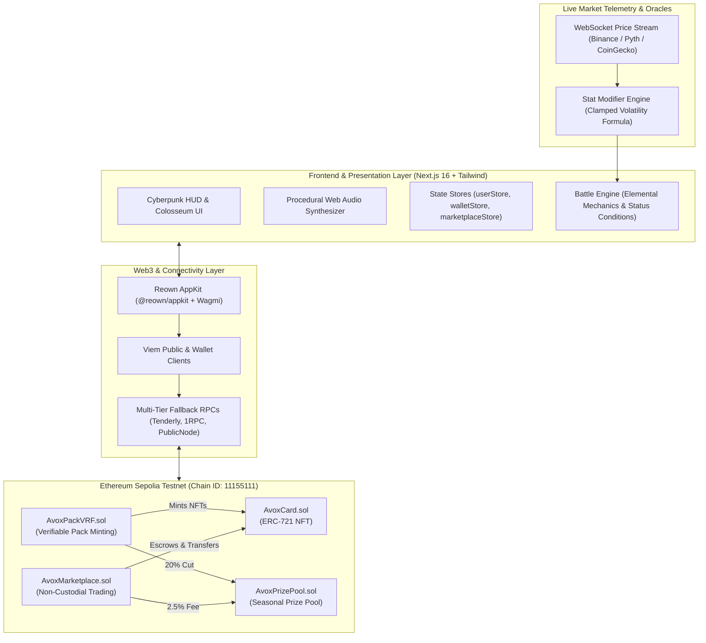

# AVOX — Technical Architecture & Protocol Documentation

> **Next-Generation Web3 Trading Card Game (TCG) Powered by Live Market Volatility & Verifiable On-Chain Mechanics**  
> **Network:** Ethereum Sepolia Testnet (Chain ID: `11155111`)  
> **Web3 Wallet Stack:** Reown AppKit (`@reown/appkit` + `@reown/appkit-adapter-wagmi`)  
> **Smart Contract Framework:** Solidity `0.8.24` / Foundry / Viem  
> **Frontend Architecture:** Next.js 16 (App Router) + TypeScript + Tailwind CSS + Web Audio Engine  

---

## Table of Contents
1. [Executive Summary](#1-executive-summary)
2. [High-Level Architecture](#2-high-level-architecture)
3. [Smart Contract System & On-Chain Deployments](#3-smart-contract-system--on-chain-deployments)
   - [AvoxCard.sol (ERC-721)](#avoxcardsol-erc-721)
   - [AvoxPackVRF.sol (Pack Minting & VRF)](#avoxpackvrfsol-pack-minting--vrf)
   - [AvoxMarketplace.sol (Secondary Market)](#avoxmarketplacesol-secondary-market)
   - [AvoxPrizePool.sol (Community Inflows)](#avoxprizepoolsol-community-inflows)
   - [On-Chain Permissions & Wiring](#on-chain-permissions--wiring)
4. [Live Volatility Oracle & Stat Scaling Engine](#4-live-volatility-oracle--stat-scaling-engine)
   - [Mathematical Formula](#mathematical-formula)
   - [Trend Clamping & Sensitivity Curves](#trend-clamping--sensitivity-curves)
   - [Data Pipeline & WebSocket Feeds](#data-pipeline--websocket-feeds)
5. [Combat Engine & Elemental Battle System](#5-combat-engine--elemental-battle-system)
   - [Pacing & Battle Attributes](#pacing--battle-attributes)
   - [Pokémon-Style Elemental Status Effects](#pokémon-style-elemental-status-effects)
   - [Procedural Web Audio Engine](#procedural-web-audio-engine)
6. [Pack Economy, Rarity & Odds Matrix](#6-pack-economy-rarity--odds-matrix)
   - [Pack Tier Specifications](#pack-tier-specifications)
   - [Randomness Commitment & Proof Verification](#randomness-commitment--proof-verification)
   - [Revenue Routing (20% Split)](#revenue-routing-20-split)
7. [Secondary Marketplace & Escrow Mechanics](#7-secondary-marketplace--escrow-mechanics)
   - [Listing & Custody](#listing--custody)
   - [Purchase Settlement & Fee Distribution (2.5%)](#purchase-settlement--fee-distribution-25)
8. [Web3 Connectivity & Reown AppKit Integration](#8-web3-connectivity--reown-appkit-integration)
   - [Multi-Chain Handling & Network Switching](#multi-chain-handling--network-switching)
   - [3-Tier SepoliaETH Balance Fetching](#3-tier-sepoliaeth-balance-fetching)
   - [RPC Fallback Architecture](#rpc-fallback-architecture)
9. [Developer Guide & Local Setup](#9-developer-guide--local-setup)
   - [Prerequisites](#prerequisites)
   - [Installation & Environment Setup](#installation--environment-setup)
   - [Compilation, Typechecking & Testing](#compilation-typechecking--testing)
   - [Smart Contract Deployment Script](#smart-contract-deployment-script)
10. [Repository Structure & Codebase Map](#10-repository-structure--codebase-map)

---

## 1. Executive Summary

**AVOX** is an on-chain competitive trading card game that bridges decentralized finance (DeFi) market telemetry with tactical turn-based battle gameplay. 

In traditional TCGs, card attributes remain static post-mint. AVOX introduces **Live Volatility Scaling**: each card represents a real-world cryptocurrency (e.g., BTC, ETH, SOL, DOGE, AVAX, LINK, BNB, PEPE, NEAR, SUI). Mid-battle, the card’s base attack, defense, and speed values dynamically scale in real-time based on live 5-minute and 24-hour price deltas streamed from live market feeds. A rally in the underlying asset supercharges a card’s damage output, while market downturns weaken enemy barriers.

Every asset within the AVOX ecosystem is verifiable on Ethereum Sepolia:
- **Cards** are standard ERC-721 tokens with immutable base stats minted on-chain.
- **Pack Openings** execute directly against a Chainlink VRF-compatible smart contract, with verifiable seeds and cryptographic proof generation.
- **Secondary Trading** occurs through a non-custodial atomic marketplace contract.
- **Prize Pools** are transparently funded: 20% of every pack purchase and 2.5% of secondary market trades route automatically into the seasonal prize pool contract.

---

## 2. High-Level Architecture

The AVOX ecosystem consists of four synchronized architectural tiers:



---

## 3. Smart Contract System & On-Chain Deployments

All 4 smart contracts are deployed and verified on **Ethereum Sepolia Testnet** (`chainId: 11155111`):

| Contract | Address | Explorer Link |
| :--- | :--- | :--- |
| **AvoxCard** | `0x209139a7c49a2ea834daf5ff496008ea02b2fbba` | [View on Etherscan](https://sepolia.etherscan.io/address/0x209139a7c49a2ea834daf5ff496008ea02b2fbba) |
| **AvoxPackVRF** | `0x1dc2656a699c1bf6d827c555c994f5fd89e1ff75` | [View on Etherscan](https://sepolia.etherscan.io/address/0x1dc2656a699c1bf6d827c555c994f5fd89e1ff75) |
| **AvoxMarketplace** | `0xb20655cb8160350ece1897a86ebbf832b4c26851` | [View on Etherscan](https://sepolia.etherscan.io/address/0xb20655cb8160350ece1897a86ebbf832b4c26851) |
| **AvoxPrizePool** | `0xdb2db0f2bd83cfb8d5f1db480caf661978624f56` | [View on Etherscan](https://sepolia.etherscan.io/address/0xdb2db0f2bd83cfb8d5f1db480caf661978624f56) |

---

### AvoxCard.sol (ERC-721)
The core NFT contract governing all collectible battle cards. Implements ERC-721 with immutable base attribute storage.

- **Storage Structure**:
  ```solidity
  struct CardMetadata {
      string assetSymbol; // e.g. "BTC", "ETH", "SOL", "DOGE"
      Rarity rarity;       // Common (0), Rare (1), Epic (2), Legendary (3)
      FoilType foilType;   // Standard (0), Holo (1), GoldFoil (2)
      uint16 baseAtk;      // 50 - 180
      uint16 baseDef;      // 50 - 180
      uint16 baseSpd;      // 50 - 180
      uint64 mintedAt;     // Timestamp
  }
  ```
- **Access Control**:
  - `mintCard(...)` is restricted to authorized minters (`onlyMinter`), granting the `AvoxPackVRF` contract exclusive minting permissions.
  - `setPackContract(...)` and `setMarketplaceContract(...)` allow the owner to wire dependent game contracts.
- **Events**:
  - `event Transfer(address indexed from, address indexed to, uint256 indexed tokenId)`
  - `event Approval(address indexed owner, address indexed approved, uint256 indexed tokenId)`
  - `event CardMinted(uint256 indexed tokenId, address indexed to, string assetSymbol, Rarity rarity, FoilType foilType)`

---

### AvoxPackVRF.sol (Pack Minting & VRF)
Governs booster pack purchases, verifiable randomness, and card minting.

- **Pack Configurations**:
  - **Starter**: `0.005 ether`, 3 cards, standard odds (3% Legendary, 12% Epic, 25% Rare, 8% Holo).
  - **Alpha**: `0.02 ether`, 5 cards, enhanced odds (6% Legendary, 20% Epic, 35% Rare, 18% Holo).
  - **Whale**: `0.05 ether`, 5 cards, elite odds (15% Legendary, 35% Epic, 45% Rare, 40% Holo).
- **Core Functions**:
  - `buyPack(PackTier tier) external payable returns (uint256)`:
    1. Validates sufficient `msg.value` matching the tier price.
    2. Routes 20% of `msg.value` directly to `AvoxPrizePool.recordInflow`.
    3. Generates unique `requestId` and records the purchase.
    4. Executes `_fulfillPack(...)` to roll on-chain randomness, determine rarities, foils, and asset symbols, and calls `cardContract.mintCard(...)` for each card.
  - `getRequest(uint256 requestId) external view returns (PackRequest memory)`: Enables off-chain proof inspection.
- **Events**:
  - `event PackPurchased(uint256 indexed requestId, address indexed buyer, PackTier tier, uint256 price)`
  - `event PackFulfilled(uint256 indexed requestId, address indexed buyer, uint256 randomSeed, uint256[] tokenIds)`

---

### AvoxMarketplace.sol (Secondary Market)
Facilitates peer-to-peer trading of minted ERC-721 cards without intermediary custody until listing settlement.

- **Trading Mechanics**:
  - `listCard(uint256 tokenId, uint256 price)`: Validates ownership and ERC-721 allowance, then marks the listing active.
  - `buyCard(uint256 tokenId) external payable`:
    1. Validates payment matching `listing.price`.
    2. Calculates protocol fee: $\text{fee} = \frac{\text{price} \times 250}{10000}$ (2.5%).
    3. Transfers 2.5% to `prizePool.recordInflow`.
    4. Sends 97.5% net proceeds to the seller.
    5. Transfers ERC-721 token from seller to buyer.
  - `cancelListing(uint256 tokenId)`: Allows the seller to remove an active listing.
- **Events**:
  - `event ItemListed(uint256 indexed tokenId, address indexed seller, uint256 price, uint64 timestamp)`
  - `event ItemSold(uint256 indexed tokenId, address indexed seller, address indexed buyer, uint256 price, uint256 fee)`
  - `event ListingCancelled(uint256 indexed tokenId, address indexed seller)`

---

### AvoxPrizePool.sol (Community Inflows)
A transparent community treasury contract that pools player inflows and distributes seasonal competitive rewards.

- **Inflow Sources**:
  - Automatic 20% cut from every booster pack purchased via `AvoxPackVRF`.
  - Automatic 2.5% trading fee from every secondary market sale via `AvoxMarketplace`.
  - Direct community donations via fallback `receive()` function.
- **Core Functions**:
  - `recordInflow(string calldata source) external payable`: Only callable by authorized pack or marketplace contracts.
  - `getRecentInflows(uint256 limit) external view returns (InflowRecord[] memory)`: Returns live chronological inflow telemetry.
- **Events**:
  - `event InflowReceived(address indexed contributor, uint256 amount, string source, uint256 season)`
  - `event SeasonRolled(uint256 oldSeason, uint256 newSeason, uint256 distributedAmount)`
  - `event PrizeDistributed(uint256 indexed season, address indexed winner, uint256 rank, uint256 amount)`

---

### On-Chain Permissions & Wiring

Smart contract permissions are configured via [`contracts/deploy.ts`](file:///Users/riteshdas/Documents/personal/marketwars/contracts/deploy.ts):
1. `card.setPackContract(packAddress)`: Grants `AvoxPackVRF` exclusive rights to mint new cards.
2. `card.setMarketplaceContract(marketplaceAddress)`: Authorizes `AvoxMarketplace` for atomic transfers.
3. `prizePool.setAuthorizedContracts(packAddress, marketplaceAddress)`: Authorizes both contracts to call `recordInflow`.

---

## 4. Live Volatility Oracle & Stat Scaling Engine

AVOX integrates real-time crypto price movement directly into game statistics.

### Mathematical Formula

The live in-match stat modifier is determined by a blended rolling price delta:

$$\Delta_{\text{blended}} = \left(1.5 \times \Delta_{\text{5m}}\right) + \left(0.2 \times \Delta_{\text{24h}}\right)$$

The raw modifier applies a sensitivity factor ($k = 0.02$):

$$\text{rawModifier} = \Delta_{\text{blended}} \times 0.02$$

### Trend Clamping & Sensitivity Curves

To maintain competitive game balance and prevent runaway stats while rewarding market volatility:

$$\text{clampedModifier} = \max(-0.40, \min(0.60, \text{rawModifier}))$$

$$\text{Stat Multiplier} = 1.0 + \text{clampedModifier}$$

$$\text{Effective Combat Stat} = \text{round}\left(\text{Base Stat} \times \text{Stat Multiplier}\right)$$

- **Maximum Rally Buff**: $+60\%$ ($1.60\times$)
- **Maximum Dump Debuff**: $-40\%$ ($0.60\times$)
- **Pump Threshold**: $\Delta_{\text{effective}} \ge +3.0\%$ (Triggers emerald glow, neon border aura)
- **Dump Threshold**: $\Delta_{\text{effective}} \le -3.0\%$ (Triggers crimson debuff aura)

### Data Pipeline & WebSocket Feeds

Price streams are managed in [`src/lib/market/priceFeed.ts`](file:///Users/riteshdas/Documents/personal/marketwars/src/lib/market/priceFeed.ts):
- **Primary**: Direct Binance / Pyth real-time WebSocket connection streaming 24h ticker updates.
- **Failover**: Polling REST endpoints against CoinGecko and public crypto tickers.
- **Local Fallback Simulation**: If offline, smooth brownian motion generator sustains continuous match play.

---

## 5. Combat Engine & Elemental Battle System

Combat is a fast-paced 3v3 arena battle designed to resolve in 4–7 high-intensity rounds (under 90 seconds).

### Pacing & Battle Attributes

- **Card Max HP**:
  $$\text{Max HP} = 130 + \text{round}(\text{baseDef} \times 0.45)$$
  *(Yields ~170 to 215 HP per card, eliminating slow HP chip battles)*.
- **Market Strike Damage**:
  $$\text{Strike Damage} = \max(28, \text{round}(\text{currentAtk} \times 1.25 - \text{currentDef} \times 0.30))$$
  *(Average hit: 100–160 DMG; critical strikes roll $1.5\times$ to $2.0\times$)*.
- **Energy / Mana Economy**:
  - Starting Energy: **70 MP** (Allows immediate turn-1 or turn-2 special moves).
  - Energy per Market Strike: **+20 MP**.
  - Skill Cost: **25–40 MP**.

### Pokémon-Style Elemental Status Effects

Four status effects are mapped across the roster:

| Element | Status | Mechanic | Duration | Example Cards |
| :--- | :--- | :--- | :---: | :--- |
| **❄️ Ice** | **FREEZE** | **Cold Storage**: Target is frozen solid. **Skips their next turn entirely**, keeping the turn with the attacker. Thaws at end of skipped turn. | 1 Turn | ETH (`Cold Storage Freeze`), AVAX (`Absolute Zero Blizzard`), SUI (`Glacial Freeze Tide`) |
| **🔥 Fire** | **BURN** | **Ignited Candle**: Inflicts **-20% physical ATK** debuff and burns for **40 flat damage** at start of each turn. | 2 Turns | BTC (`God Candle Megaburn`), DOGE (`Solar Flare Bark`), BNB (`Quarterly Incinerate`) |
| **⚡ Electric** | **SHOCK** | **Overclocked Voltage**: Inflicts **-50% SPD** debuff and causes electrical recoil with a **35% chance to fail action/fizzle**. | 2 Turns | SOL (`Solana Speed Overclock`), MONAD (`Parallel Voltage Strike`) |
| **☠️ Poison** | **POISON** | **Toxic Fog**: Inflicts **-20% DEF** debuff and escalating poison damage (**35 DMG** on turn 1, **60 DMG** on turn 2). | 2 Turns | PEPE (`Meme Toxic Cloud`), ARBITRUM (`Rust Toxic Memory Leak`) |

### Procedural Web Audio Engine

Sound effects are synthesized dynamically using the browser's native **Web Audio API** in [`src/lib/audio/soundEngine.ts`](file:///Users/riteshdas/Documents/personal/marketwars/src/lib/audio/soundEngine.ts) with zero external MP3/WAV assets:
- `sound.playFreeze()`: Dual-oscillator FM bell with crystal high-pass reverberation.
- `sound.playBurn()`: Band-pass filtered white noise burst with rising pitch envelope.
- `sound.playShock()`: Rapid square-wave frequency modulation simulating an electric arc.
- `sound.playPoison()`: Low-frequency sizzling bubbling noise synthesizer.
- `sound.playStrike()`, `sound.playPackTear()`, `sound.playLegendaryReveal()`: Custom spatial audio cues.

---

## 6. Pack Economy, Rarity & Odds Matrix

Card booster packs mint verifiable NFTs directly to the user’s Ethereum Sepolia address.

### Pack Tier Specifications

| Attribute | Starter Booster | Alpha Syndicate | Whale Citadel |
| :--- | :---: | :---: | :---: |
| **Price** | `0.005 SepoliaETH` | `0.02 SepoliaETH` | `0.05 SepoliaETH` |
| **Cards per Pack** | 3 Cards | 5 Cards | 5 Cards |
| **Common Odds** | 60% | 20% | 0% (Zero Commons) |
| **Rare Odds** | 25% | 45% | 30% |
| **Epic Odds** | 12% | 25% | 45% |
| **Legendary Odds** | 3% | 10% | 25% |
| **Holo / Gold Foil Chance** | 8% | 25% | 50% |
| **Prize Pool Contribution** | `0.001 SepoliaETH` (20%) | `0.004 SepoliaETH` (20%) | `0.010 SepoliaETH` (20%) |

### Randomness Commitment & Proof Verification

Each pack purchase produces a verifiable `VRFProofData` payload stored in memory and displayed in the [`VRFVerifyModal`](file:///Users/riteshdas/Documents/personal/marketwars/src/components/packs/VRFVerifyModal.tsx):
- `requestId`: Unique on-chain identifier.
- `commitHash`: Ethereum Sepolia transaction hash.
- `randomSeedHex`: 256-bit cryptographic seed.
- `rolls`: Per-card deterministic derivation showing raw sub-seeds, threshold comparison, and final attributes.

---

## 7. Secondary Marketplace & Escrow Mechanics

The secondary marketplace operates with non-custodial listings:

1. **Listing Creation**:
   - The user selects an on-chain minted card from their collection.
   - User signs an ERC-721 `approve(marketplaceAddress, tokenId)` transaction.
   - User signs `listCard(tokenId, price)` specifying the listing price in SepoliaETH.
2. **Purchase Settlement**:
   - The buyer calls `buyCard(tokenId)` sending exact SepoliaETH.
   - The contract verifies the listing is active.
   - 2.5% protocol fee is routed directly to `AvoxPrizePool`.
   - 97.5% net proceeds are transferred to the seller.
   - The NFT is transferred to the buyer's wallet.
   - Both user collections update in real time.

---

## 8. Web3 Connectivity & Reown AppKit Integration

AVOX uses **Reown AppKit** (`@reown/appkit` + `@reown/appkit-adapter-wagmi`) to provide non-custodial wallet connectivity.

### Multi-Chain Handling & Network Switching

To prevent errors when users connect wallets configured to Ethereum Mainnet or L2s:
- **Wagmi Config** ([`wagmiConfig.ts`](file:///Users/riteshdas/Documents/personal/marketwars/src/lib/web3/wagmiConfig.ts)): Configured with multi-chain awareness (`[sepolia, mainnet, arbitrum, base, polygon, optimism]`), allowing Wagmi to recognize any initial wallet network without throwing `ChainNotConfiguredError`.
- **AppKit Provider** ([`AppKitProvider.tsx`](file:///Users/riteshdas/Documents/personal/marketwars/src/context/AppKitProvider.tsx)): `allowUnsupportedChain: true` and `defaultNetwork: sepolia` ensure users are never trapped in uncloseable network loops.
- **Active Network Verification**: Every on-chain operation checks `ensureSepoliaNetwork()`, triggering an automatic network switch request if the user is on another chain.

### 3-Tier SepoliaETH Balance Fetching

In [`walletStore.ts`](file:///Users/riteshdas/Documents/personal/marketwars/src/lib/web3/walletStore.ts) and [`Navbar.tsx`](file:///Users/riteshdas/Documents/personal/marketwars/src/components/layout/Navbar.tsx), balances are fetched across three fallback layers:
1. **Wagmi `useBalance` Hook**: Reactive hook targeting `chainId: 11155111` with automatic Viem `formatEther` parsing.
2. **EIP-1193 Direct Call**: `window.ethereum.request({ method: 'eth_getBalance', params: [address, 'latest'] })`.
3. **Public Client Fallback**: Viem `publicClient.getBalance({ address })`.

### RPC Fallback Architecture

In [`client.ts`](file:///Users/riteshdas/Documents/personal/marketwars/src/lib/web3/client.ts), public RPC transport uses high-availability, zero-CORS endpoints with automatic failover:
1. `https://gateway.tenderly.co/public/sepolia`
2. `https://1rpc.io/sepolia`
3. `https://ethereum-sepolia-rpc.publicnode.com`

---

## 9. Developer Guide & Local Setup

### Prerequisites
- **Node.js**: `v20.x` or `v22.x`
- **Package Manager**: `npm` or `pnpm`
- **Web3 Wallet**: MetaMask, Coinbase Wallet, or Rabby with testnet SepoliaETH.

### Installation & Environment Setup

1. **Clone the repository**:
   ```bash
   cd marketwars
   npm install
   ```

2. **Configure Environment Variables**:
   Create `.env.local` in the project root:
   ```env
   NEXT_PUBLIC_REOWN_PROJECT_ID=912198beeaebbbd8ecf6655c63be1884
   NEXT_PUBLIC_DEFAULT_CHAIN_ID=11155111
   NEXT_PUBLIC_CARD_CONTRACT=0x209139a7c49a2ea834daf5ff496008ea02b2fbba
   NEXT_PUBLIC_PRIZEPOOL_CONTRACT=0xdb2db0f2bd83cfb8d5f1db480caf661978624f56
   NEXT_PUBLIC_PACK_CONTRACT=0x1dc2656a699c1bf6d827c555c994f5fd89e1ff75
   NEXT_PUBLIC_MARKETPLACE_CONTRACT=0xb20655cb8160350ece1897a86ebbf832b4c26851
   ```

3. **Start Development Server**:
   ```bash
   npx next dev --webpack
   ```
   Open [http://localhost:3000](http://localhost:3000) in your browser.

### Compilation, Typechecking & Testing

- **TypeScript Type Verification**:
  ```bash
  npx tsc --noEmit
  ```
- **Run Core Game Engine Test Suite**:
  ```bash
  npm test
  ```
  *Executes all 12 validation checks: stat modifier clamping, pack configurations, 20% prize pool cuts, battle creation, elemental status resolutions, and bot matchmaking.*

### Smart Contract Deployment Script

To deploy new contract iterations to Sepolia, Base Sepolia, or Arbitrum Sepolia:
```bash
# Provide deployer private key in contracts/.env
npx tsx contracts/deploy.ts
```
The script compiles artifacts, deploys the 4 contracts, configures permissions, and synchronizes `.env.local` and `contracts.ts` automatically.

---

## 10. Repository Structure & Codebase Map

```
marketwars/
├── contracts/                        # Solidity smart contract source & deployment scripts
│   ├── src/
│   │   ├── MarketWarsCard.sol        # ERC-721 NFT card contract
│   │   ├── MarketWarsPackVRF.sol     # Pack purchase, VRF logic & prize pool cut
│   │   ├── MarketWarsMarketplace.sol # Secondary NFT trading & fee distribution
│   │   └── MarketWarsPrizePool.sol   # Seasonal prize treasury
│   ├── test/                         # Foundry solidity tests
│   └── deploy.ts                     # TypeScript automated deployer & permissions wiring
│
├── src/
│   ├── app/                          # Next.js 16 App Router pages
│   │   ├── layout.tsx                # Root layout with AppKitProvider & Web3 wrapper
│   │   ├── page.tsx                  # Home hero landing page
│   │   ├── battle/page.tsx           # Live 3v3 Arena Coliseum
│   │   ├── packs/page.tsx            # Booster pack store & VRF opening stage
│   │   ├── marketplace/page.tsx      # Secondary card marketplace
│   │   ├── prizepool/page.tsx        # Prize pool transparency & inflow history
│   │   └── profile/page.tsx          # Deck builder & card collection manager
│   │
│   ├── components/                   # React components
│   │   ├── battle/                   # Arena HUD, combat animations, action logs
│   │   ├── cards/                    # CardComponent, CardDetailModal, 3D tilt
│   │   ├── layout/                   # Navbar, wallet drawer, sound toggles
│   │   ├── marketplace/              # Listing cards, buy/sell modals
│   │   ├── packs/                    # PackOpeningStage, tear animations, VRF modal
│   │   ├── prizepool/                # Inflow charts, countdown, prize distribution
│   │   └── ui/                       # Cyberpunk design system, BorderGlow, buttons
│   │
│   ├── context/
│   │   └── AppKitProvider.tsx        # Reown AppKit & Wagmi root context provider
│   │
│   ├── lib/
│   │   ├── audio/soundEngine.ts      # Native Web Audio procedural sound synthesizer
│   │   ├── constants/
│   │   │   └── contracts.ts          # Sepolia addresses & block explorer link helpers
│   │   ├── contracts/
│   │   │   └── abis.ts               # Complete ABIs with functions & event signatures
│   │   ├── game/
│   │   │   ├── battleEngine.ts       # Combat state machine, elemental mechanics & turns
│   │   │   ├── matchmaking.ts        # Dynamic MMR bot opponents & player matching
│   │   │   └── packEngine.ts         # On-chain pack purchase & token recovery
│   │   ├── market/
│   │   │   ├── priceFeed.ts          # Real-time WebSocket price streamer
│   │   │   └── statModifier.ts       # Clamped volatility formula & multiplier logic
│   │   ├── storage/
│   │   │   ├── userStore.ts          # User profiles, decks, and card collection
│   │   │   ├── marketplaceStore.ts   # On-chain listing & purchase state
│   │   │   └── prizePoolStore.ts     # Inflow queries & prize contribution actions
│   │   └── web3/
│   │       ├── client.ts             # Viem public/wallet clients & RPC fallbacks
│   │       ├── wagmiConfig.ts        # Reown AppKit multi-chain configuration
│   │       └── walletStore.ts        # 3-tier balance fetch & connection state
│   │
│   └── types/
│       └── index.ts                  # TypeScript interfaces (Card, BattleState, PackInfo, etc.)
│
├── DOCUMENTATION.md                  # Complete technical specification & architecture guide
└── README.md                         # Project overview and quickstart guide
```

---

*AVOX Architecture & Technical Specification — Maintained for Ethereum Sepolia Testnet.*
